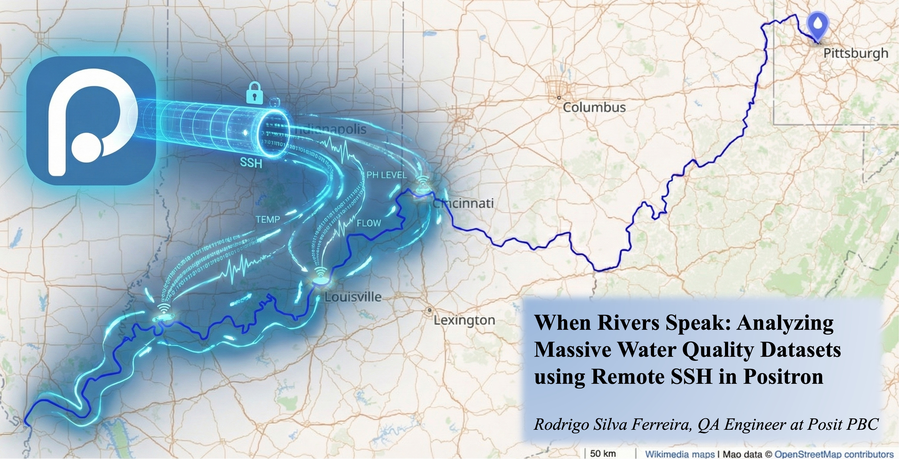

# When Rivers Speak: Analyzing Massive Water Quality Datasets using USGS API and Remote SSH in Positron



This project is designed to run efficiently on remote compute environments, including through **[Remote SSH in Positron](https://positron.posit.co/remote-ssh.html)**, which allows large datasets and long-running processes to be handled on remote machines while maintaining a smooth local development experience.

**When Rivers Speak** is a data-engineering pipeline that collects and processes large volumes of water-quality measurements from the USGS National Water Information System (NWIS). It ingests millions of sensor readings across all U.S. states and produces compact, analysis-ready Parquet datasets.

## Features
- Automated data collection from the USGS Water Services API  
- Parquet output for efficient storage and fast querying  
- Parallel processing across thousands of monitoring sites  
- Compatible with Remote SSH in Positron, AWS EC2, and other remote servers  
- Ready for downstream analysis in Python, DuckDB, and related tools

## Workflow

### 1. Fetch nationwide stream sites
```bash
python fetch-sites.py
```
Generates: `usgs_stream_sites.parquet`

### 2. Collect IV data per state
```bash
python collect.py
```
Outputs Parquet files into: `state_parquet/`

## Requirements
- Python 3.10+  
- requests  
- pandas  
- pyarrow or fastparquet  
- tqdm  

## Purpose
U.S. rivers generate continuous environmental time series at national scale. This project provides a reproducible pipeline for transforming raw API responses into structured datasets suitable for research, modeling, and environmental monitoring.

## License
MIT License

## Disclaimers

By accessing or using this repository, you agree to the following terms:

- The materials in this repository are provided on an “as is” and “as available” basis for research and educational purposes only.
- No guarantees are made regarding accuracy, completeness, or suitability for any specific use. 
- By using this repository, you agree that all use is at your own risk, and that the author assumes no responsibility or liability for any damages, losses, or legal issues arising from your use, modification, or distribution of this code or data.
- Users are solely responsible for ensuring that their use of the included code and data complies with all applicable laws, platform terms of service, and ethical guidelines.
- Nothing in this repository should be interpreted as legal advice.

## Contact

Rodrigo Silva Ferreira  
rodrigosf672@gmail.com  
[LinkedIn](https://www.linkedin.com/in/rsf309/) | [GitHub](https://github.com/rodrigosf672)
